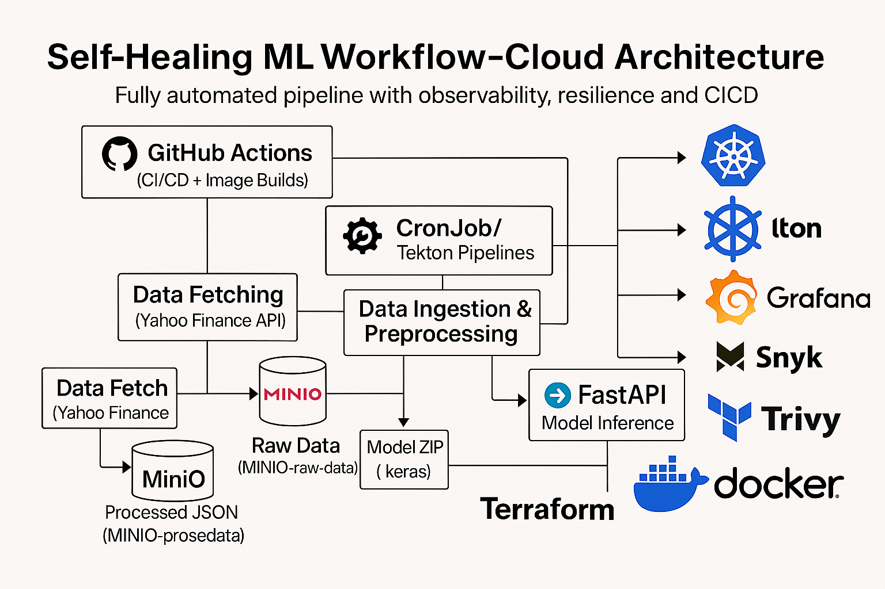

# 🧠 Self-Healing ML Workflow for Stock & Forex Predictions

A production grade, self-healing machine learning workflow built on Kubernetes. This system fetches financial data, processes it, trains models, version-controls data & models with DVC, and serves predictions via a FastAPI microservice.

---

## 🏗️ Architecture Overview

                

---

## 🔧 Tech Stack

                | Category          | Tooling                            |
                |-------------------|------------------------------------|
                | Containerization  | Docker                             |
                | Orchestration     | Kubernetes (Minikube)              |
                | CI/CD             | GitHub Actions + DockerHub         |
                | ML Framework      | TensorFlow                         |
                | Data Handling     | Pandas, NumPy                      |
                | Serving           | FastAPI + Uvicorn                  |
                | Storage           | MinIO                              |
                | Monitoring        | Prometheus, Grafana                |
                | Logging           | Loki + Promtail                    |
                | Security          | Snyk, Trivy                        |
                | IaC               | Terraform                          |
                | Data Versioning   | DVC                                |
                | Pipelines         | Tekton Pipelines                   |

---

## 🚀 Getting Started

### 🖥️ Prerequisites

- [Docker](https://www.docker.com/)
- [Minikube](https://minikube.sigs.k8s.io/docs/start/)
- [kubectl](https://kubernetes.io/docs/tasks/tools/)
- [Terraform](https://developer.hashicorp.com/terraform/install)
- [Tilt](https://tilt.dev/)
- [DVC](https://dvc.org/)
- [Python 3.9+](https://www.python.org/)
- `~/.kube/config` configured for Minikube

---

## ⚙️ Project Setup

1. **Clone the repository**

```bash
git clone https://github.com/JuanLDev/self-healing-ml-workflow.git
cd self-healing-ml-workflow
```

2. *Start Minikube & apply Terraform*
```bash
minikube start
cd terraform
terraform init
terraform apply -auto-approve
```

3. *Run Tekton Pipelines*
```bash
tkn pipeline start ml-pipeline
tkn pipelinerun logs -f
```

4. *Expose FastAPI for model inference*
```bash
kubectl port-forward svc/model-api-service 8000:80 -n default
```
Then visit: http://localhost:8000/docs

---

## 🧰 Developer Notes

### ⚙️ CI/CD Pipeline

GitHub Actions builds and pushes Docker images for each pipeline step.

Security scans via Snyk and Trivy.

Build matrix includes: data-fetch, data-ingestion, model-training, fastapi-model

---

## 📦 DVC

DVC is used to track raw data, processed files, and trained models.

Remote storage: MinIO

Example commands:
```bash
dvc pull
dvc push
dvc repro
```
---
## 🔒 Security

Snyk & Trivy scans added to GitHub Actions

.snyk & .trivyignore files in place to suppress low-risk warnings

Health probes (/health) added to FastAPI for K8s liveness/readiness

---

## 📊 Monitoring & Logs

Access Grafana: http://localhost:3000

Access Prometheus: http://localhost:9090

Access MinIO: http://localhost:9001

Use port forwarding if needed:
```bash
kubectl port-forward svc/grafana 3000:3000 -n monitoring
kubectl port-forward svc/minio-service 9001:9001 -n default
```

---

🧠 Author
Juan Lugo
GitHub: @juanldev

Built with ❤️ — and a lot of debugging.
